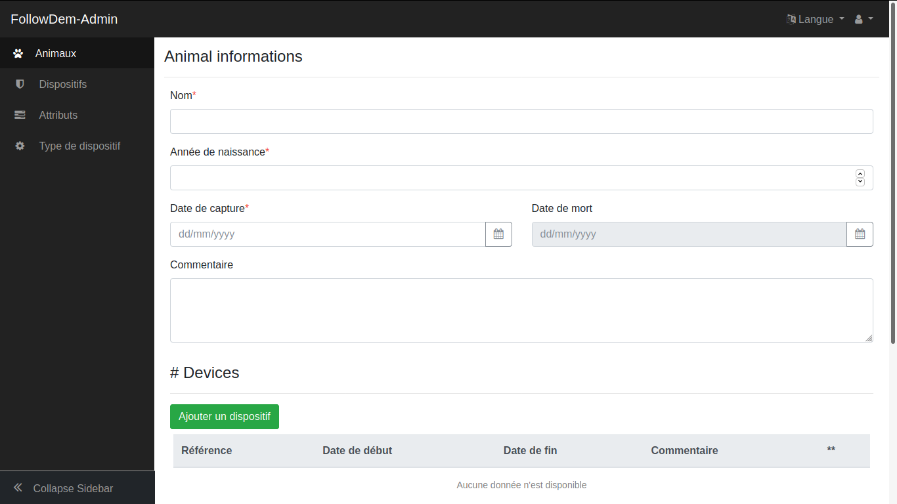

# FollowDem-admin

Backoffice de FollowDem permettant de créer la base de données et d'administrer les données

- Python / Flask
- Authentification : utilise le sous-module https://github.com/PnX-SI/UsersHub-authentification-module
- ``id_application`` de UsersHub en paramètre
- On importe toutes les données TXT dans la BDD (PostgreSQL et si possible MySQL). 
- Des règles (nb sat, HDOP, 2D/3D, altitude, boundingbox des XY) définissent si les localisations sont utilisées ou non. Les valeurs sont paramétrables. A mettre en place
- Les tables sont dans un schéma dédié, permettant de fonctionner de manière autonome ou dans une BDD existante (GeoNature notamment)
- L'appli front utilise des vues (matérialisée ou non ?).

## ADMIN

- Une liste des animaux, une des devices. Afficher, éditer, supprimer, ajouter. 
- Le détail d'un animal permet d'afficher ses associations à des devices, de les modifier et d'en ajouter.

## Install 

- Documentation d'installation : https://github.com/PnEcrins/FollowDem-admin/tree/master/docs/installation.rst
- Ce dépôt ne contient et n'installe que la BDD et le backend de FollowDem-admin. Il faut ensuite installer son frontend (https://github.com/PnEcrins/FollowDem-admin-front)
- Ensuite il est possible d'installer FollowDem (https://github.com/PnEcrins/FollowDem) pour rendre accessible les localisations des objets suivis dans une interface simple et grand public
